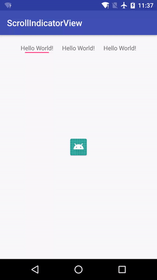

# ScrollIndicatorView
an indicator bar view scrolling with ViewPager



### Configuration item
```
    indicator_color: the indicator bar's color
    indicator_height: the indicator bar's height , default is 2dp
    indicator_offset: horizontal offset relative to indicateView, default is 10dp
    item_margin: margin of indicateView, default is 20dp
```

### Usage
#### add component to layout like (check detail in sample project):
~~~xml
    <com.zhqchen.scrollindicatorview.ScrollIndicatorView
                android:id="@+id/siv_indicator"
                android:layout_width="match_parent"
                android:layout_height="wrap_content"
                android:layout_below="@id/ll_item"
                android:layout_alignLeft="@id/ll_item"
                android:layout_alignRight="@id/ll_item"
                app:indicator_height="2dp"
                app:indicator_color="@color/colorAccent"
                app:indicator_offset="10dp"
                app:item_margin="20dp"/>
~~~
### License

	Copyright 2017 Zhq Chen

	Licensed under the Apache License, Version 2.0 (the "License");	you may not use this file except in compliance with the License.
	You may obtain a copy of the License at

		http://www.apache.org/licenses/LICENSE-2.0

	Unless required by applicable law or agreed to in writing, software
	distributed under the License is distributed on an "AS IS" BASIS,
	WITHOUT WARRANTIES OR CONDITIONS OF ANY KIND, either express or implied.
	See the License for the specific language governing permissions and
	limitations under the License.